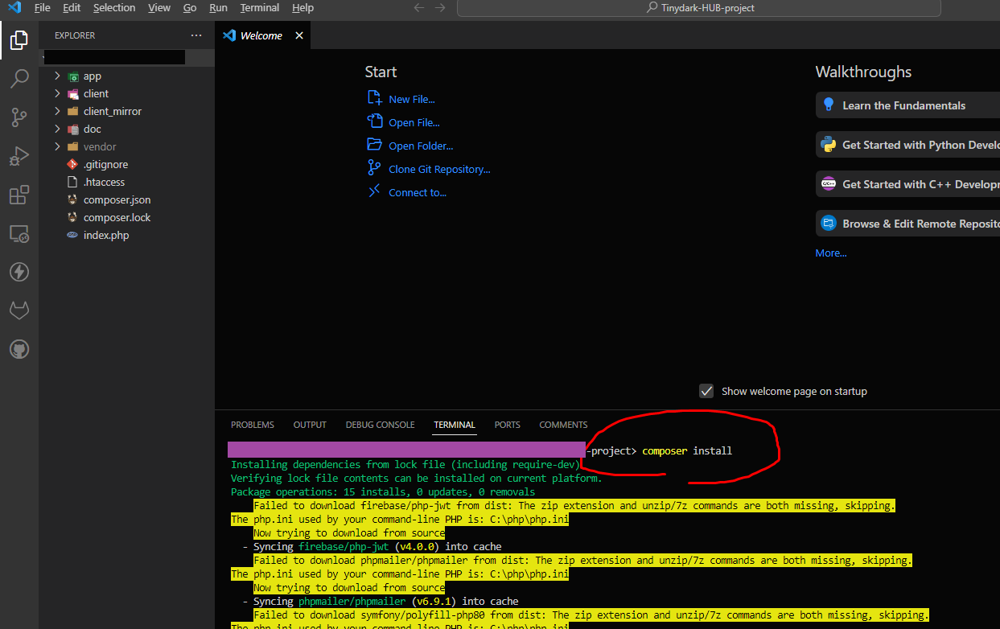
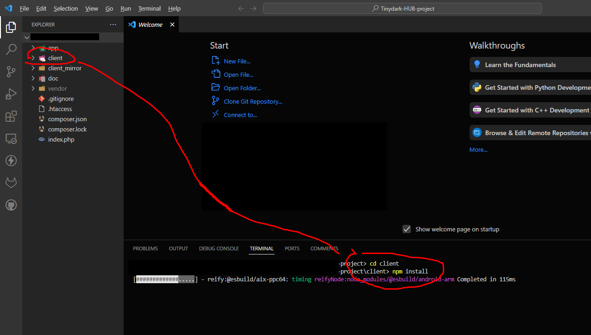
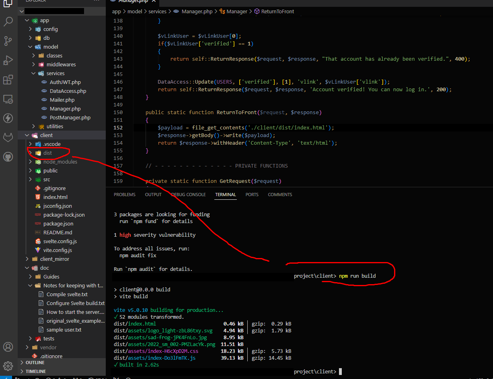
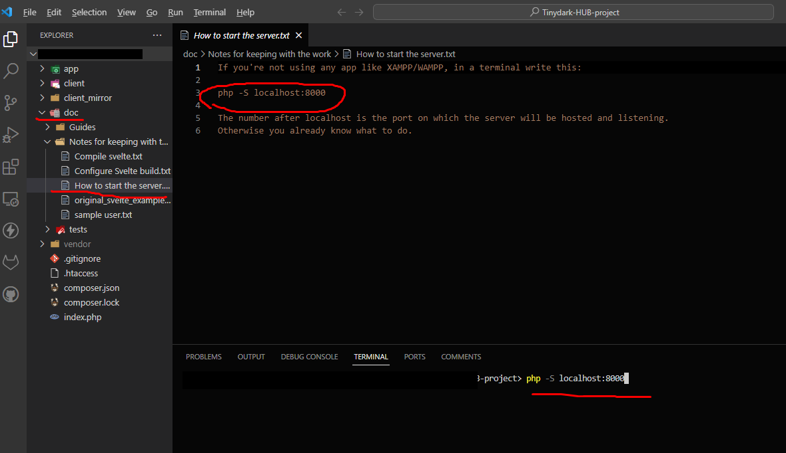

#INSTRUCTIONS
****

###1st
**We start a terminal at the root of the project and run the line `composer install` in order to download all the required packages and libraries and create and populate the folder `vendor`.**
**This will also create the required file `autoload.php` inside `vendor`, which is required for the back to run.**

***
###2nd
**We open another terminal and switch to the folder `client`, where we run the line `npm install`. This will create the folder `node_modules` inside the folder client will all the required packages for the project to run**

***
###3rd
**We now run the line `npm run build`, which will run *Vite's* compiler and create the folder `dist`, where the compiled front will be placed.** 

***
###4th
**Finally we run the line `php -S localhost:8000` (which you can also find in one of the personal notes in a folder) to start our server. The port is up to you and doesn't have to be `8000`, but the front is configured to run on that port so you must change the URL at every place where a request to the back is performed.**

***

**After this the project will be online and ready.**
***
###An important note:
**The mailer system requires to be configured with your SMTP data and credentials, or it won't work otherwise. There's a sample file to configure it inside `app/config` named `smtp_example.json`. All you need is to edit that file's content and and rename it to `smtp.json` after that, or either create your own file `smtp.json` with the required data.**